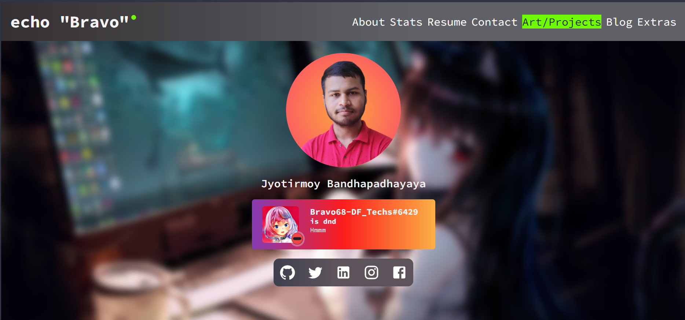

<h1 align="center">Welcome to my portfolio 👋</h1>

<!--  -->

  

 

## 📜 Overview

#### ➡️ Link: https://itsmebravo.dev

#### About this Repo :-

This Repo cotains source code for my developer portfolio at https://itsmebravo.dev. I reworked my existed portfolio to nextjs for make it faster and integrate my existing API at https://api.bravo68web.me

#### Features :-

- Discord Integration
- Online Status Checker
- Resume Embed
- Custom User Stats representations
- Art and Project Showcase
- Custom Error page (including 404 and 500 response error)
- More to be added soon ...

#### Technologies Used:-

 

 

## 😊 Author

**BRAVO68WEB**

- Website: https://itsmebravo.dev
- Twitter: [@BRAVO68WEB](https://twitter.com/BRAVO68WEB)
- GitHub: [@BRAVO68WEB](https://github.com/BRAVO68WEB)
- LinkedIn: [@BRAVO68WEB](https://linkedin.com/in/BRAVO68WEB)

 

### 😽 Show your support

Star the repository if this project helped you! ⭐️

### 📝 License

Copyright © 2023 [BRAVO68WEB](https://github.com/BRAVO68WEB).

This project is [CC-BY-ND-4.0](LICENSE) licensed.
